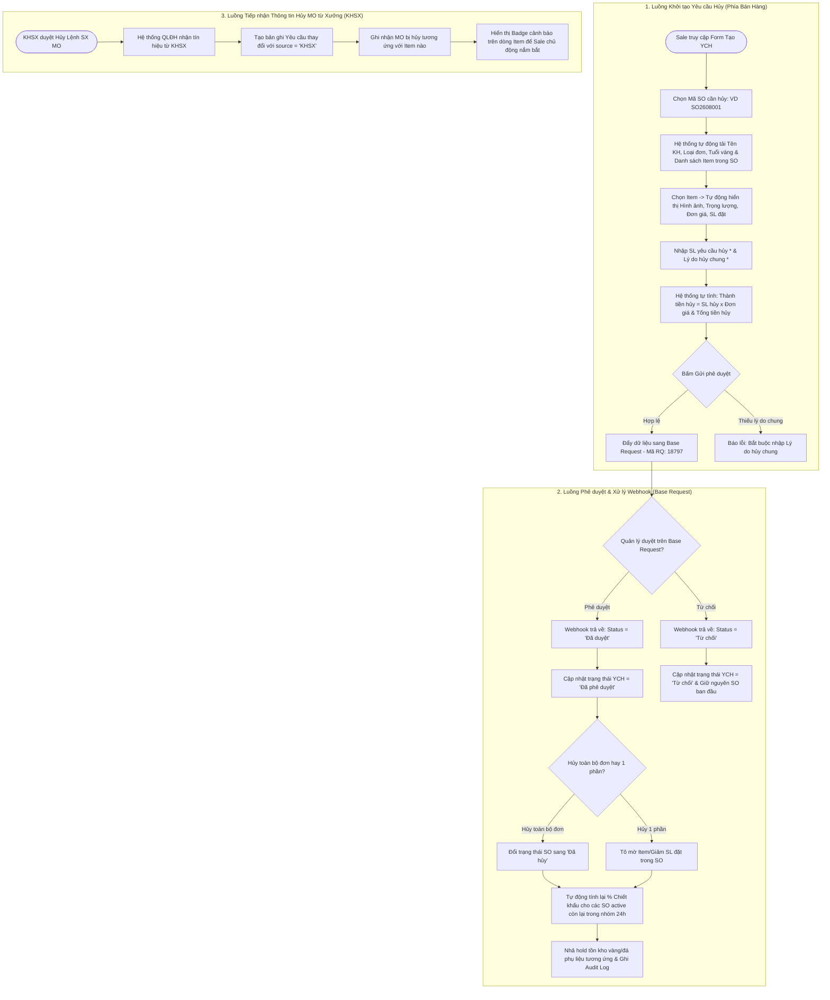

# US-3.10: Hủy Số Lượng Đơn Sau Xác Nhận Đơn Hàng

> **Mã Story:** `US-DH-10` *(Mã tham chiếu Confluence: `US-3.10`)*  
> **Module:** Quản lý đơn hàng (Sales Order Management)  
> **Feature:** Yêu cầu hủy đơn hàng sau xác nhận (Post-Confirmation Sales Order Cancellation)  
> **Áp dụng:** Hệ thống Bán Hàng & ERP Kim Hoàn - Sevago Jewelry  

---

## 1. Tóm tắt User Story (User Story Statement)
*   **AS A:** Nhân viên Kinh doanh (Sale) / Sale Admin
*   **I WANT TO:** Tạo yêu cầu hủy đơn hàng (SO) sau khi đơn đã được xác nhận — bao gồm: Hủy toàn bộ đơn hàng, Hủy từng dòng sản phẩm (Item), hoặc Hủy giảm số lượng trong từng món, tích hợp phê duyệt qua Base Request và đồng bộ với Kế hoạch sản xuất (KHSX)
*   **SO THAT:**
    *   Gửi đề xuất lên cấp Quản lý phê duyệt với đầy đủ hình ảnh, trọng lượng, đơn giá, giá trị giảm trừ và lý do hủy minh bạch.
    *   Tự động tính toán lại tỷ lệ (%) chiết khấu cho nhóm các đơn hàng active còn lại (trong khung 24h) sau khi duyệt hủy thành công.
    *   Tự động giải phóng (nhả hold) tồn kho nguyên phụ liệu/đá quý và cập nhật trạng thái Lệnh sản xuất (MO) chính xác, hạn chế lãng phí chi phí gia công.

---

## 2. Luồng Nghiệp vụ (Business Flow)

---

## 3. Quy tắc Nghiệp vụ (Business Rules)

### BR-01: Ràng buộc Trạng thái Yêu cầu Duy nhất
*   Một đơn hàng (SO) hoặc một dòng sản phẩm (Item) tại một thời điểm **chỉ được phép tồn tại tối đa 1 yêu cầu chỉnh sửa/hủy đang ở trạng thái "Chờ phê duyệt"**.
*   Hệ thống khóa không cho phép tạo đề xuất đè lên cho đến khi yêu cầu cũ được đóng lại (*Đã phê duyệt* hoặc *Từ chối*).

### BR-02: Cơ chế Tính toán lại Tỷ lệ Chiết khấu Nhóm Đơn (Recalculate Discount)
*   Khi yêu cầu hủy đơn/giảm số lượng được duyệt, hệ thống tự động kiểm tra xem đơn hàng đó có nằm trong **Nhóm gộp đơn hưởng chiết khấu lũy kế (trong vòng 24h)** hay không.
*   Nếu có: Hệ thống tự động tính lại tổng doanh số nhóm hợp lệ $\rightarrow$ Xác định lại mốc % chiết khấu chính xác $\rightarrow$ Cập nhật lại giá trị chiết khấu cho các đơn hàng active còn lại.

### BR-03: Đồng bộ Tồn kho & Lệnh Sản Xuất (MO)
*   Khi hủy thành công:
    *   Số lượng vàng/đá quý đã giữ chỗ (Hold) cho các Item bị hủy sẽ được hoàn trả về tồn kho khả dụng.
    *   Tự động gửi thông báo sang phân hệ KHSX để hủy/giảm số lượng của Lệnh sản xuất (MO) tương ứng nhằm dừng công đoạn chế tác kịp thời.

---

## 4. Danh mục Dữ liệu & Ràng buộc Giao diện (Field Specifications)

### 4.1. Màn hình Danh sách Yêu cầu Hủy SO (`/cancel-requests`)
| STT | Tên trường | Kiểu dữ liệu | Bắt buộc | Quy tắc hiển thị & Validation |
| :---: | :--- | :--- | :---: | :--- |
| 1 | **STT** | Số nguyên | Có | Tăng dần tự động (1, 2, 3...). |
| 2 | **Mã yêu cầu** | Chuỗi (Text) | Có | Mã định danh duy nhất (VD: `YCH-2026-001`), màu xanh `#005a46`, click để xem chi tiết. |
| 3 | **Mã SO** | Chuỗi (Text) | Có | Mã đơn hàng gốc (VD: `SO2608001`). |
| 4 | **Tổng SL hủy** | Số nguyên | Có | Tổng số lượng sản phẩm hủy (Cộng dồn từ Subtable). |
| 5 | **Người yêu cầu** | Chuỗi (Text) | Có | Tên nhân viên tạo yêu cầu (VD: `Nguyễn Văn An`). |
| 6 | **Ngày yêu cầu** | Ngày (Date) | Có | Định dạng `DD/MM/YYYY`. |
| 7 | **Người phê duyệt** | Chuỗi (Text) | Không | Tên quản lý đã duyệt. Hiển thị `-` nếu đang chờ duyệt. |
| 8 | **Ngày phê duyệt** | Ngày (Date) | Không | Định dạng `DD/MM/YYYY`. Hiển thị `-` nếu đang chờ duyệt. |
| 9 | **Trạng thái** | Enum | Có | Badge màu phân biệt: • `Chờ phê duyệt` (Vàng - `bg-yellow-50 text-yellow-700`) • `Đã phê duyệt` (Xanh lá - `bg-green-50 text-green-700`) • `Từ chối` (Đỏ - `bg-red-50 text-red-700`) |
| 10 | **Thao tác** | Action | Có | Icon Sửa ✏️ (khi Chờ duyệt) và Xóa 🗑️. |

---

### 4.2. Form Tạo / Chỉnh sửa Yêu cầu Hủy (`/cancel-requests/create`)

#### Card 1: Thông tin chung
| Tên trường | Loại Input | Bắt buộc | Quy tắc hiển thị & Nghiệp vụ |
| :--- | :--- | :---: | :--- |
| **Mã yêu cầu** | Text Input | Read-only | Tự động sinh theo quy tắc `YCH-YYYY-XXX`. |
| **Mã SO cần hủy** | Select Dropdown | **Có (*)** | Chỉ hiển thị các SO hợp lệ (VD: `SO2608001`, `SO2608002`...). |
| **Mã - Tên Khách hàng** | Text Input | Read-only | Tự động lấy từ SO gốc (VD: `2000001 - Công ty TNHH Vàng Bạc Kim Yến`). |
| **Tóm tắt đơn hàng** | Badge/Card | Read-only | Tự động hiển thị `Loại đơn hàng: Đơn hàng Bán | Nguyên liệu: Vàng | Tuổi vàng: 61Y`. |
| **Lý do hủy chung** | Text Input | **Có (*)** | Bắt buộc nhập lý do tổng quát cho đợt hủy (Tối đa 500 ký tự). |

#### Card 2: Chi tiết danh sách sản phẩm hủy (Subtable)
| STT | Cột hiển thị | Kiểu dữ liệu | Bắt buộc | Mô tả & Quy tắc hiển thị |
| :---: | :--- | :--- | :---: | :--- |
| 1 | **STT** | Số nguyên | Có | Thứ tự các Item trong đợt hủy (1, 2, 3...). |
| 2 | **Hình ảnh** | Image Thumbnail | Read-only | Hiển thị ảnh mẫu trang sức thu nhỏ trực quan. |
| 3 | **Mã Item (Trong SO)** | Select Dropdown | **Có (*)** | **Chỉ hiển thị danh sách các Item thực tế có trong SO đã chọn.** |
| 4 | **Trọng lượng** | Text / Badge | Read-only | Tự động lấy từ master data (VD: `0.85 chỉ (3.19g)`). |
| 5 | **Đơn giá** | Currency | Read-only | Đơn giá niêm yết trong đơn hàng gốc (Định dạng VND). |
| 6 | **SL đặt trong SO** | Number / Badge | Read-only | Hiển thị số lượng đặt ban đầu để đối soát. |
| 7 | **SL yêu cầu hủy** | Number Input | **Có (*)** | Số nguyên dương (`1 <= SL hủy <= SL đặt trong SO`). |
| 8 | **Thành tiền hủy** | Currency | Read-only | Tự động tính: `SL yêu cầu hủy × Đơn giá`. |
| 9 | **Lý do hủy chi tiết** | Text Input | **Không** | Ghi chú cụ thể cho từng món nếu có (VD: Đổi ni tay, giảm ngân sách...). |
| 10 | **Xóa dòng** | Action | Có | Icon 🗑️ (Yêu cầu có tối thiểu ít nhất 1 dòng sản phẩm). |

---

### 4.3. Cấu trúc Payload gửi sang Base Request (Mã Nhóm Đề Xuất: 18797)
| Tên trường (Payload Key) | Quy tắc Mapping / Sinh dữ liệu | Ví dụ thực tế |
| :--- | :--- | :--- |
| **Tên đề xuất** | `Yêu cầu hủy [Item/Đơn hàng] - [Mã SO]` | `Yêu cầu hủy Item - SO2608001` |
| **Nhóm đề xuất** | Yêu cầu chỉnh sửa đơn hàng | `Mã RQ: 18797` |
| **Người đề xuất** | `[Tên Nhân Viên] - [MSNV]` | `Nguyễn Văn An - NV0082` (Lấy từ User session) |
| **Khách hàng** | `[Mã KH] - [Tên KH]` | `2000001 - Công ty TNHH Vàng Bạc Kim Yến` |
| **Bảng chi tiết hủy** | Mảng dữ liệu các Item hủy | Bao gồm: `Mã Item`, `Tên SP`, `Hình ảnh`, `Trọng lượng`, `SL đặt`, `SL hủy`, `Thành tiền hủy`, `Link chi tiết SO` |
| **Lý do hủy** | Lấy từ trường `Lý do hủy chung` | `Khách hàng yêu cầu đổi sang chất liệu vàng trắng 75W` |

---

## 5. Tiêu chí Chấp nhận (Acceptance Criteria - Gherkin)

### AC 3.10.1: Lọc Mã Item và hiển thị trực quan thông tin sản phẩm
*   **Given:** Người dùng đang ở màn hình tạo mới `/cancel-requests/create`.
*   **When:** Người dùng chọn `Mã SO cần hủy = "SO2608001"`.
*   **Then:** Dropdown `Mã Item` ở Subtable chỉ hiển thị các sản phẩm thuộc về đơn hàng `SO2608001`.
*   **And:** Các cột `Hình ảnh`, `Trọng lượng`, `Đơn giá`, `SL đặt trong SO` tự động hiển thị thông tin chính xác của sản phẩm được chọn.

### AC 3.10.2: Tự động tính Thành tiền hủy và Tổng giá trị đợt hủy
*   **Given:** Sản phẩm `GY0RG000086A00... - Nhẫn Kim Cương` có Đơn giá = `5.200.000 đ`.
*   **When:** Người dùng nhập `SL yêu cầu hủy = 2`.
*   **Then:** Cột `Thành tiền hủy` hiển thị `10.400.000 đ` và dòng `Tổng cộng đợt hủy` ở chân bảng tự động cộng dồn giá trị tương ứng.

### AC 3.10.3: Xử lý Webhook Phê duyệt từ Base Request
*   **Given:** Yêu cầu hủy đơn đang ở trạng thái `Chờ phê duyệt`.
*   **When:** Quản lý thực hiện phê duyệt đề xuất trên hệ thống Base Request và Webhook trả về kết quả thành công.
*   **Then:** Hệ thống QLĐH cập nhật trạng thái yêu cầu sang `Đã phê duyệt`.
*   **And:** Đổi trạng thái SO sang `Đã hủy` (nếu hủy toàn bộ đơn) hoặc cập nhật giảm trừ số lượng tương ứng trên từng dòng Item.
*   **And:** Hệ thống tự động kích hoạt tiến trình tính toán lại % chiết khấu cho các đơn hàng active còn lại trong nhóm 24h.
*   **And:** Ghi nhận thông tin người duyệt, ngày duyệt và Audit Log lịch sử thay đổi.

### AC 3.10.4: Xử lý Webhook Từ chối từ Base Request
*   **Given:** Yêu cầu hủy đơn đang ở trạng thái `Chờ phê duyệt`.
*   **When:** Quản lý bấm `Từ chối` trên Base Request.
*   **Then:** Hệ thống QLĐH cập nhật trạng thái yêu cầu sang `Từ chối`.
*   **And:** Giữ nguyên trạng thái và số lượng sản phẩm của đơn hàng SO ban đầu.

### AC 3.10.5: Tiếp nhận kết quả duyệt Hủy MO từ Kế hoạch sản xuất (KHSX)
*   **Given:** Phân hệ KHSX duyệt yêu cầu hủy Lệnh sản xuất (MO) và gửi thông báo sang QLĐH.
*   **When:** Hệ thống QLĐH tiếp nhận tín hiệu từ KHSX.
*   **Then:** Tự động tạo một bản ghi Yêu cầu thay đổi với nguồn khởi tạo `source = 'KHSX'`.
*   **And:** Ghi nhận thông tin Lệnh MO bị hủy tương ứng với Item nào trong đơn hàng.
*   **And:** Trên danh sách sản phẩm của SO, dòng Item chứa MO bị hủy sẽ hiển thị Badge thông báo nổi bật để Sale theo dõi.

---

## 6. Definition of Done (DoD)
- [x] Tài liệu tuân thủ định dạng chuẩn 5 phần theo `US_Template_Standard.md`.
- [x] Có đầy đủ sơ đồ luồng Mermaid Diagram bóc tách 3 luồng: Sale tạo, Base Request duyệt, và KHSX tích hợp.
- [x] Dữ liệu mẫu chuẩn hóa 100% theo quy chuẩn ERP Kim hoàn Sevago Jewelry (`SO2608001`, `2000001 - Vàng Kim Yến`, Trọng lượng `chỉ/gram`, Đơn giá VND).
- [x] Khớp hoàn toàn với Prototype giao diện đang chạy tại `http://localhost:3000/cancel-requests/create`.
