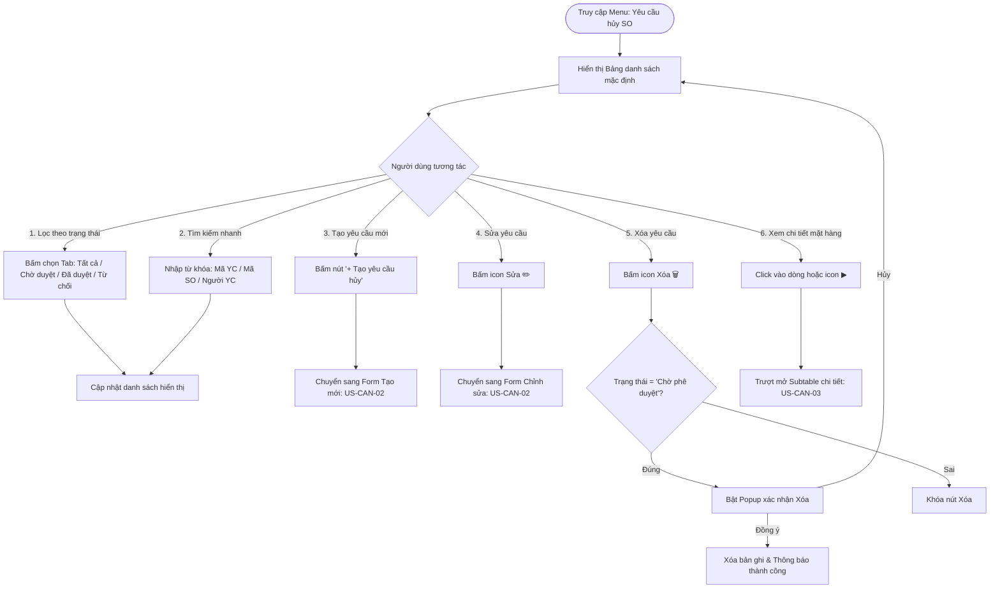

# US-CAN-01: Màn hình Danh sách Yêu cầu Hủy SO

> **Mã Story:** `US-CAN-01`  
> **Module:** Quản lý đơn hàng (Sales Order Management)  
> **Feature:** Yêu cầu hủy SO (Cancel Sales Order Requests)  
> **Tác giả:** @ba-master (AI Airlearn)  
> **Trạng thái:** Sẵn sàng phát triển (Ready for Dev)  

---

## 1. Tóm tắt User Story (User Story Statement)
*   **AS A:** Nhân viên Kinh doanh / Quản lý Kinh doanh
*   **I WANT TO:** Xem danh sách các yêu cầu hủy SO tập trung với các bộ lọc trạng thái, công cụ tìm kiếm và các nút thao tác nhanh
*   **SO THAT:** Tôi có thể theo dõi tiến độ xử lý đơn hủy, kiểm soát số lượng sản phẩm hủy và quản trị quy trình kịp thời.

---

## 2. Luồng Nghiệp vụ (Business Flow)

---

## 3. Đặc tả Cột Dữ liệu (Field Specifications)

| STT | Tên cột | Kiểu dữ liệu | Bắt buộc | Mô tả & Quy tắc hiển thị |
| :---: | :--- | :--- | :---: | :--- |
| 1 | **STT** | Số nguyên | Có | Số thứ tự tăng dần (1, 2, 3...). |
| 2 | **Mã yêu cầu** | Chuỗi (Text) | Có | Mã định danh duy nhất (VD: `YCH-2026-001`), màu xanh `#005a46`, click để xem chi tiết. |
| 3 | **Mã SO** | Chuỗi (Text) | Có | Mã đơn hàng gốc cần hủy (VD: `CO2806 001`). |
| 4 | **Tổng SL hủy** | Số nguyên | Có | Tổng số lượng sản phẩm hủy (Cộng dồn từ Subtable), hiển thị dạng Badge nổi bật. |
| 5 | **Người yêu cầu** | Chuỗi (Text) | Có | Tên nhân viên tạo yêu cầu (VD: `Nguyễn Văn An`). |
| 6 | **Ngày yêu cầu** | Ngày (Date) | Có | Định dạng `DD/MM/YYYY`. |
| 7 | **Người phê duyệt** | Chuỗi (Text) | Không | Tên quản lý đã duyệt. Hiển thị `-` nếu đang chờ duyệt. |
| 8 | **Ngày phê duyệt** | Ngày (Date) | Không | Định dạng `DD/MM/YYYY`. Hiển thị `-` nếu đang chờ duyệt. |
| 9 | **Trạng thái** | Phân loại (Enum) | Có | Badge màu phân biệt:  • `Chờ phê duyệt` (Vàng - `bg-yellow-50 text-yellow-700`) • `Đã phê duyệt` (Xanh lá - `bg-green-50 text-green-700`) • `Từ chối` (Đỏ - `bg-red-50 text-red-700`) |
| 10 | **Thao tác** | Hành động | Có | Icon Sửa ✏️ và Xóa 🗑️. |

---

## 4. Tiêu chí Chấp nhận (Acceptance Criteria - Gherkin)

### AC 1.1: Hiển thị danh sách và Tabs trạng thái
*   **Given:** Người dùng đã đăng nhập và truy cập vào trang `/cancel-requests`.
*   **When:** Trang tải thành công.
*   **Then:** Hệ thống hiển thị 4 Tabs trạng thái: `Tất cả (N)`, `Chờ phê duyệt (N)`, `Đã phê duyệt (N)`, `Từ chối (N)`.
*   **And:** Bảng hiển thị đầy đủ 10 cột dữ liệu theo đúng đặc tả.

### AC 1.2: Lọc dữ liệu theo Tab
*   **Given:** Người dùng đang ở màn hình danh sách.
*   **When:** Người dùng click vào Tab `Chờ phê duyệt`.
*   **Then:** Bảng chỉ hiển thị các dòng có `Trạng thái = "Chờ phê duyệt"`.
*   **And:** Con số đếm trên Tab khớp chính xác với số lượng bản ghi hiển thị.

### AC 1.3: Tìm kiếm tức thì (Live Search)
*   **Given:** Người dùng nhập từ khóa vào ô tìm kiếm (VD: "CO2806").
*   **When:** Chuỗi nhập có độ dài ≥ 1 ký tự.
*   **Then:** Hệ thống tự động lọc danh sách không phân biệt hoa thường theo các trường `Mã yêu cầu`, `Mã SO`, `Người yêu cầu` với thời gian phản hồi ≤ 300ms.

### AC 1.4: Xóa yêu cầu hủy
*   **Given:** Yêu cầu hủy ở trạng thái `Chờ phê duyệt`.
*   **When:** Người dùng click vào icon Xóa (🗑️).
*   **Then:** Hệ thống bật hộp thoại xác nhận: `"Chị đẹp có chắc chắn muốn xóa yêu cầu [Mã YC] không?"`.
*   **And:** Khi chọn Xác nhận, bản ghi bị xóa khỏi danh sách và hiển thị thông báo thành công.

---

## 5. Definition of Done (DoD)
- [x] Giao diện chuẩn UI/UX Sevago Jewelry, tương thích hiển thị trên màn hình Desktop.
- [x] Đầy đủ các bộ lọc Tab, thanh tìm kiếm và phân quyền nút hành động.
- [x] Đã kiểm thử chức năng Xóa, Lọc Tab hoạt động chính xác trên Prototype.
