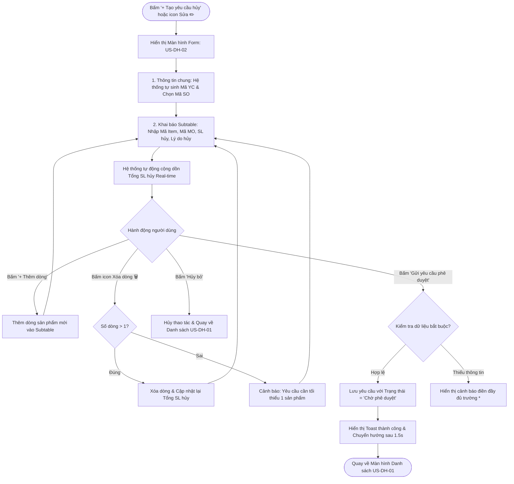

# US-DH-02: Màn hình Tạo mới và Chỉnh sửa Yêu cầu Hủy SO

> **Mã Story:** `US-DH-02`  
> **Module:** Quản lý đơn hàng (Sales Order Management)  
> **Feature:** Yêu cầu hủy SO (Cancel Sales Order Requests)  

---

## 1. Tóm tắt User Story (User Story Statement)
*   **AS A:** Nhân viên Kinh doanh
*   **I WANT TO:** Tạo mới hoặc chỉnh sửa yêu cầu hủy SO với form thông tin tinh gọn và bảng Subtable kê khai chi tiết các mặt hàng cần hủy
*   **SO THAT:** Tôi có thể gửi yêu cầu lên cấp quản lý phê duyệt với số lượng và lý do hủy minh bạch, chính xác.

---

## 2. Luồng Nghiệp vụ (Business Flow)

---

## 3. Quy tắc Nghiệp vụ & Ràng buộc Dữ liệu (Business Rules)

### BR 2.1: Cấu trúc Form Thông tin chung
| Trường dữ liệu | Loại Input | Ràng buộc / Validate | Ghi chú hiển thị |
| :--- | :--- | :--- | :--- |
| **Mã yêu cầu** | Text Input | Bắt buộc, Read-only | Tự động sinh theo quy tắc `YCH-YYYY-XXX`. |
| **Mã SO cần hủy** | Select Dropdown | Bắt buộc | Chỉ chọn các SO hợp lệ (chưa xuất kho / chưa hoàn tất). |
| **Tổng SL hủy** | Number Input | Bắt buộc, Read-only | Tự động cộng dồn từ cột `SL yêu cầu hủy` của Subtable. |
| **Lý do / Ghi chú** | Text Input | Tùy chọn, Max 500 ký tự | Diễn giải lý do chung của đợt hủy. |

### BR 2.2: Ràng buộc Bảng chi tiết (Subtable)
*   **Tối thiểu 1 dòng:** Yêu cầu hủy phải có ít nhất 1 dòng sản phẩm chi tiết. Nếu chỉ còn 1 dòng, hệ thống không cho phép xóa.
*   **Số lượng hủy hợp lệ:** `SL yêu cầu hủy` phải là số nguyên dương (`> 0`) và không được vượt quá số lượng đặt còn lại của Item đó trong SO gốc.
*   **Cập nhật tự động (Real-time):** Mọi thao tác thêm/xóa dòng hoặc thay đổi số lượng ở Subtable sẽ lập tức cập nhật lại giá trị tại ô `Tổng SL hủy` ở Card 1 và dòng `Tổng cộng` ở chân bảng Subtable.

---

## 4. Tiêu chí Chấp nhận (Acceptance Criteria - Gherkin)

### AC 2.1: Tự động cộng dồn Tổng số lượng hủy
*   **Given:** Người dùng đang ở màn hình tạo mới `/cancel-requests/create`.
*   **When:** Người dùng nhập `SL yêu cầu hủy` cho Dòng 1 = `2` và Dòng 2 = `3`.
*   **Then:** Ô `Tổng SL hủy` ở Thông tin chung và dòng `Tổng cộng` ở Subtable lập tức hiển thị giá trị là `5 SP`.

### AC 2.2: Thêm dòng sản phẩm mới
*   **Given:** Bảng Subtable đang có N dòng sản phẩm.
*   **When:** Người dùng click vào nút `+ Thêm dòng sản phẩm`.
*   **Then:** Hệ thống thêm một dòng trống mới vào cuối bảng với STT = `N + 1` và giá trị mặc định `SL hủy = 1`.

### AC 2.3: Chặn xóa dòng cuối cùng (Edge Case)
*   **Given:** Bảng Subtable chỉ còn đúng 1 dòng sản phẩm duy nhất.
*   **When:** Người dùng click vào icon Xóa (🗑️) của dòng đó.
*   **Then:** Hệ thống hiển thị cảnh báo: `"Yêu cầu hủy cần tối thiểu ít nhất 1 sản phẩm chi tiết!"` và giữ nguyên dòng sản phẩm.

### AC 2.4: Gửi yêu cầu phê duyệt thành công
*   **Given:** Người dùng đã điền đầy đủ các thông tin bắt buộc.
*   **When:** Người dùng click nút `Gửi yêu cầu phê duyệt`.
*   **Then:** Hệ thống tạo bản ghi mới với trạng thái `Chờ phê duyệt`.
*   **And:** Hiển thị thông báo (Toast/Banner) thành công và chuyển hướng về `/cancel-requests` sau 1.5 giây.

### AC 2.5: Nút Hủy bỏ
*   **Given:** Người dùng đang nhập dở dữ liệu trên form.
*   **When:** Người dùng click nút `Hủy bỏ` hoặc `Quay lại danh sách`.
*   **Then:** Hệ thống điều hướng quay về màn hình danh sách `/cancel-requests` mà không lưu dữ liệu tạm.

---

## 5. Definition of Done (DoD)
- [x] Giao diện Form đáp ứng đúng quy tắc ẩn 4 trường Audit.
- [x] Logic tính tổng số lượng Real-time hoạt động không có độ trễ.
- [x] Đầy đủ các thông báo xác thực (Validation error & Success message).
- [x] Đã verify chạy hoàn hảo trên Prototype.
