# US-DH-02: Tạo Yêu Cầu Hủy Đơn Hàng (SO) & Tích Hợp Phê Duyệt Base Request - KHSX

> **Mã Story:** `US-DH-02`  
> **Module:** Quản lý đơn hàng (Sales Order Management)  
> **Feature:** Yêu cầu hủy SO (Cancel Sales Order Requests)  
> **Tích hợp:** Base Request (Workflow Approval) & KHSX (Manufacturing Planning Sync)  

---

## 1. USER STORY (User Story Statement)

*   **Là một (As a):** Admin / Sale Admin
*   **Tôi muốn (I want):** Tạo yêu cầu hủy đơn hàng (SO) sau khi đơn đã được xác nhận — bao gồm:
    *   Hủy toàn bộ đơn hàng (Cancel Full SO)
    *   Hủy từng dòng sản phẩm (Cancel Specific Item)
    *   Hủy giảm số lượng trong từng món (Reduce Item Quantity)
    *   Tích hợp phê duyệt qua **Base Request** và đồng bộ với **Kế hoạch sản xuất (KHSX)**
*   **Để (So that):**
    *   Gửi đề xuất lên cấp Quản lý phê duyệt với đầy đủ hình ảnh, trọng lượng, đơn giá, giá trị giảm trừ và lý do hủy minh bạch.
    *   Tự động tính toán lại tỷ lệ (%) chiết khấu cho nhóm các đơn hàng active còn lại (trong khung 24h) sau khi duyệt hủy thành công.

---

## 2. LUỒNG NGHIỆP VỤ (Business Flow Diagram)

```mermaid
flowchart TD
    Start([Sale Admin vào Form Tạo Yêu Cầu Hủy]) --> SelectSO[1. Chọn Mã SO cần hủy - VD: SO2608001]
    
    SelectSO --> AutoFill[2. Tự động hiển thị Tên Khách hàng, Loại đơn, Nguyên liệu, Tuổi vàng]
    AutoFill --> InputGeneralReason[3. Nhập Lý do hủy chung * Bắt buộc]
    
    InputGeneralReason --> SubtableSection[4. Chọn Mã Item trong SO -> Tự động load Ảnh, Trọng lượng, Đơn giá, SL đặt]
    SubtableSection --> InputCancelQty[5. Nhập SL yêu cầu hủy & Lý do hủy chi tiết nếu có]
    InputCancelQty --> AutoCalc[6. Hệ thống tự động tính Thành tiền hủy & Tổng giá trị hủy]
    
    AutoCalc --> ClickSubmit[7. Bấm 'Gửi yêu cầu phê duyệt']
    ClickSubmit --> ValidateBR01{Kiểm tra BR-01: Đã có Yêu cầu nào đang 'Chờ duyệt' trên SO/Item này chưa?}
    
    ValidateBR01 -->|Đã tồn tại| BlockSubmit[Báo lỗi: Đang có yêu cầu chờ duyệt trên đơn/món này!]
    ValidateBR01 -->|Chưa có| CreateRecord[Tạo bản ghi YCH trên QLĐH với Trạng thái = 'Chờ phê duyệt']
    
    CreateRecord --> SendBase[8. Bắn API sang Base Request: Nhóm Yêu cầu chỉnh sửa đơn hàng - Mã RQ: 18797]
    
    SendBase --> WaitApproval([Chờ Quản lý Phê duyệt trên Base Request])
    
    WaitApproval --> BaseWebhook{Base Request trả Webhook kết quả}
    
    BaseWebhook -->|PHÊ DUYỆT| WebhookApprove[Xử lý Kết quả Duyệt:]
    WebhookApprove --> UpdateYCHStatus[1. Đổi trạng thái YCH -> 'Đã phê duyệt' + Ghi log Người/Ngày duyệt]
    UpdateYCHStatus --> UpdateSOStatus{Hủy toàn bộ hay hủy 1 phần?}
    UpdateSOStatus -->|Hủy toàn bộ SO| CancelFullSO[Đổi trạng thái SO -> 'Đã hủy đơn']
    UpdateSOStatus -->|Hủy từng Item/Giảm SL| MaskItem[Tô mờ Item bị hủy & Cập nhật SL còn lại trong SO]
    
    CancelFullSO --> RecalcDiscount[2. Tự động recalculate % chiết khấu nhóm đơn active trong 24h: BR-02]
    MaskItem --> RecalcDiscount
    RecalcDiscount --> SyncKHSX[3. Đồng bộ thông tin sang KHSX để hủy MO liên quan]
    SyncKHSX --> FinishApprove([Hoàn tất quy trình duyệt])
    
    BaseWebhook -->|TỪ CHỐI| WebhookReject[Xử lý Từ chối:]
    WebhookReject --> RejectYCH[Đổi trạng thái YCH -> 'Từ chối' + Giữ nguyên SO hiện tại]
    RejectYCH --> FinishReject([Kết thúc])
    
    %% Luồng KHSX chủ động gửi sang
    KHSXEvent([KHSX duyệt Hủy MO]) -.-> SyncToQLDH[Gửi Webhook sang QLĐH]
    SyncToQLDH -.-> CreateKHSXYCH[Tạo bản ghi với source = 'KHSX' & Hiển thị Badge thông báo trên Item cho Sale]
```

---

## 3. TIÊU CHÍ CHẤP NHẬN (Acceptance Criteria - AC)

### AC 2.1: Lọc Mã Item và hiển thị trực quan thông tin sản phẩm
*   **Given (Biết rằng):** Người dùng đang ở màn hình tạo Yêu cầu hủy.
*   **When (Khi):** Người dùng chọn `Mã SO cần hủy`, ví dụ: `"SO2608001"`.
*   **Then (Thì):** Dropdown `Mã Item` $\rightarrow$ chỉ hiển thị các sản phẩm thuộc về đơn hàng `SO2608001`.
*   **And (Và):** Các cột `Hình ảnh`, `Trọng lượng`, `Đơn giá`, `SL đặt trong SO` tự động hiển thị thông tin chính xác của sản phẩm được chọn.

### AC 2.2: Tự động tính Thành tiền hủy và Tổng giá trị hủy
*   **Given (Biết rằng):** Sản phẩm `GY0RG000086...` có Đơn giá = `200.000 đ` (hoặc đơn giá niêm yết trong SO).
*   **When (Khi):** Người dùng nhập `SL yêu cầu hủy = 2`.
*   **Then (Thì):** Cột `Thành tiền hủy` hiển thị `400.000 đ` và dòng `Tổng cộng đợt hủy` ở chân bảng tự động cộng dồn giá trị tương ứng.

### AC 2.3: Phê Duyệt / Từ Chối Hủy Đơn Từ Base Request
*   **Given (Biết rằng):** Yêu cầu Hủy đơn được gửi duyệt Base.
*   **When (Khi):** Base Request trả kết quả Webhook:
    *   **Phê duyệt:** Cập nhật trạng thái yêu cầu sang `Đã duyệt`, đồng thời:
        1. Đổi trạng thái SO sang `Đã hủy đơn` nếu hủy toàn bộ đơn; hoặc tô mờ item bị hủy trong đơn kèm cập nhật lại số lượng còn lại.
        2. Tự động recalculate % chiết khấu của các đơn hàng active còn lại trong nhóm gộp chiết khấu (theo khung 24h).
        3. Ghi nhận thông tin người duyệt, ngày duyệt và Audit Log lịch sử thay đổi.
    *   **Từ chối:** Cập nhật trạng thái Yêu cầu sang `Từ chối`, đồng thời giữ nguyên đơn SO hiện tại.

### AC 2.4: Tiếp nhận kết quả duyệt Hủy MO từ KHSX
*   **Given (Biết rằng):** KHSX yêu cầu Hủy MO được phê duyệt, thông tin được gửi sang QLĐH.
*   **Then (Thì):** Hệ thống QTĐH ghi nhận thông tin từ KHSX, sau đó:
    1. Tạo một bản ghi yêu cầu thay đổi với nguồn khởi tạo `source = 'KHSX'`.
    2. Ghi nhận thông tin Yêu cầu Hủy MO tương ứng với item nào.
    3. Trên lưới sản phẩm, dòng item tương ứng (chứa MO bị hủy) sẽ hiển thị **Badge thông báo** để Sale theo dõi kịp thời.

---

## 4. QUY TẮC NGHIỆP VỤ (Business Rules)

*   **BR-01 (Ràng buộc Yêu cầu):** Một đơn hàng hoặc dòng sản phẩm tại một thời điểm chỉ được phép tồn tại tối đa **1 yêu cầu chỉnh sửa** đang ở trạng thái *"Chờ duyệt"*. Hệ thống sẽ chặn tạo yêu cầu mới nếu yêu cầu trước đó chưa có kết quả phê duyệt.
*   **BR-02 (Tính toán lại Tỷ lệ Chiết khấu Nhóm Đơn):** Khi yêu cầu hủy đơn / giảm số lượng được duyệt thành công, hệ thống tự động kiểm tra nhóm các đơn hàng active được gộp chiết khấu trong khung 24h. Hệ thống tự động tính lại tổng doanh thu đạt được và cập nhật lại mức % chiết khấu và số tiền chiết khấu chính xác cho các đơn hàng active còn lại.

---

## 5. DANH MỤC DỮ LIỆU & RÀNG BUỘC (Data Catalog & Constraints)

### 5.1 Danh sách Yêu cầu hủy
| Tên trường (Field Name) | Kiểu dữ liệu (Type) | Bắt buộc (Required) | Quy tắc validation & Nghiệp vụ (Rules) |
| :--- | :--- | :---: | :--- |
| **Mã yêu cầu** | Chuỗi (Text) | Có | Mã định danh duy nhất (VD: `YCH-2026-001`), màu xanh `#005a46`, click để xem chi tiết. |
| **Mã SO** | Chuỗi (Text) | Có | Mã đơn hàng gốc cần hủy (VD: `SO2608001`). |
| **Tổng SL hủy** | Số nguyên | Có | Tổng số lượng sản phẩm hủy (tính tổng từ subtable). |
| **Người yêu cầu** | Chuỗi (Text) | Có | Tên nhân viên tạo yêu cầu. |
| **Ngày yêu cầu** | Ngày (Date) | Có | Định dạng `DD/MM/YYYY`. |
| **Người phê duyệt** | Chuỗi (Text) | Không | Tên quản lý đã duyệt. Hiển thị `-` nếu đang chờ duyệt. |
| **Ngày phê duyệt** | Ngày (Date) | Không | Định dạng `DD/MM/YYYY`. Hiển thị `-` nếu đang chờ duyệt. |
| **Trạng thái** | Phân loại (Enum) | Có | Badge màu phân biệt:  • `Chờ phê duyệt` (Vàng - `bg-yellow-50 text-yellow-700`) • `Đã phê duyệt` (Xanh lá - `bg-green-50 text-green-700`) • `Từ chối` (Đỏ - `bg-red-50 text-red-700`) |
| **Thao tác** | Hành động | Có | Icon Sửa ✏️ và Xóa 🗑️. |

---

### 5.2.1 Cấu trúc Form Thông tin chung
| Tên trường (Field Name) | Kiểu dữ liệu (Type) | Bắt buộc (Required) | Quy tắc validation & Nghiệp vụ (Rules) |
| :--- | :--- | :---: | :--- |
| **Mã yêu cầu** | Text Input | Read-only | Tự động sinh theo quy tắc `YCH-YYYY-XXX`. |
| **Mã SO cần hủy** | Select Dropdown | Có | Chỉ chọn các SO hợp lệ (VD: `SO2608001`, `SO2608002`...). |
| **Mã - Tên Khách hàng** | Text Input | Read-only | Tự động lấy tên khách hàng từ SO gốc (VD: `2000001 - Công ty TNHH Vàng Bạc Kim Yến`). |
| **Loại đơn** | Text / Badge | Read-only | Tự động hiển thị theo đơn hàng gốc (Đơn hàng Bán / Đơn hàng Gia công). |
| **Nguyên liệu / Tuổi vàng** | Text / Badge | Read-only | Tự động hiển thị theo đơn hàng gốc (Vàng / 61Y, 41.6Y, 75W...). |
| **Lý do hủy** | Text Input | Có | Nhập lý do tổng quát của đợt hủy (Max 500 ký tự). |

---

### 5.2.2 Chi tiết sản phẩm (Subtable)
| Tên trường (Field Name) | Kiểu dữ liệu (Type) | Bắt buộc (Required) | Quy tắc validation & Nghiệp vụ (Rules) |
| :--- | :--- | :---: | :--- |
| **Hình ảnh** | Image Thumbnail | Read-only | Ảnh mẫu thu nhỏ của sản phẩm vàng/trang sức. |
| **Mã Item (Trong SO)** | Select Dropdown | Có | Chỉ hiển thị danh sách các Item thực tế có trong SO đã chọn. |
| **Trọng lượng** | Text / Badge | Read-only | Trọng lượng sản phẩm (VD: `0.85 chỉ (3.19g)`). |
| **Đơn giá** | Number / Currency | Read-only | Đơn giá niêm yết trong SO gốc (Định dạng VND). |
| **SL đặt trong SO** | Text / Badge | Read-only | Số lượng đã đặt ban đầu để người dùng đối soát tránh nhập vượt quá. |
| **SL yêu cầu hủy** | Number Input | Có | Số nguyên dương (`1 <= SL hủy <= SL đặt trong SO`). |
| **Tổng tiền hủy** | Currency | Read-only | Tự động tính: `SL yêu cầu hủy × Đơn giá`. |
| **Lý do hủy chi tiết** | Text Input | Không | Ghi chú cụ thể cho từng món nếu có (VD: Khách đổi ni tay, lỗi kỹ thuật...). |

---

### 5.3 Thông tin Gửi module request Yêu cầu chỉnh sửa đơn hàng (Base Request Mapping)

#### Thông tin đề xuất (Proposal Meta)
| Tên trường (Field Name) | Quy tắc Mapping / Sinh dữ liệu | Ghi chú |
| :--- | :--- | :--- |
| **Tên đề xuất** | `Yêu cầu hủy [Item/Đơn hàng] - [Mã đơn hàng]` | VD: `Yêu cầu hủy Item - SO2608001` |
| **Nhóm đề xuất** | `Yêu cầu chỉnh sửa đơn hàng` | Mã RQ: `18797` |
| **Người đề xuất** | `[Tên + MSNV]` | Lấy từ tài khoản User đang đăng nhập. |
| **Khách hàng** | `Mã khách hàng + Tên khách hàng` | VD: `2000001 - Công ty TNHH Vàng Bạc Kim Yến` |

#### Thông tin bảng chi tiết hủy gửi Base Request (Items Subtable Payload)
| Cột dữ liệu | Quy tắc Mapping | Chi tiết / Diễn giải |
| :--- | :--- | :--- |
| **Mã item** | Mã item muốn hủy | Lấy từ danh sách các Item được chọn trong Subtable. |
| **Chủng loại** | Tên chủng loại / Tên SP | Lấy tên sản phẩm từ Master Data. |
| **Số lượng đặt** | SL item | Số lượng đặt ban đầu của Item trong SO. |
| **Số lượng hủy** | Số lượng hủy | Số lượng nhân viên đề xuất hủy. |
| **Chi tiết đơn hàng** | Đường dẫn link | Đường dẫn URL link trực tiếp đến trang chi tiết đơn hàng trên hệ thống. |
| **Lý do hủy** | `[Lý do thay đổi]` | Lấy từ trường `Lý do hủy chung` và `Lý do chi tiết`. |

---

## 6. THIẾT KẾ (UX/UI) & PROTOTYPE

*   **Form Tạo mới Yêu cầu hủy:** 👉 [http://localhost:3000/cancel-requests/create](http://localhost:3000/cancel-requests/create)
*   **Bảng Danh sách Yêu cầu hủy:** 👉 [http://localhost:3000/cancel-requests](http://localhost:3000/cancel-requests)
*   **Danh sách Đơn hàng gốc:** 👉 [http://localhost:3000/](http://localhost:3000/)

---

## 7. TIÊU CHÍ HOÀN THÀNH (Definition of Done - DoD)

- [x] Đầy đủ 5 phần theo chuẩn BA: User Story, Flowchart Mermaid, Acceptance Criteria Gherkin, Business Rules, Data Catalog.
- [x] Đặc tả chi tiết luồng tích hợp Webhook Base Request (Mã RQ: 18797) và đồng bộ KHSX.
- [x] Định nghĩa tường minh quy tắc Recalculate % chiết khấu nhóm đơn trong 24h (BR-02).
- [x] Giao diện Prototype đã đồng bộ hiển thị Hình ảnh, Trọng lượng, Đơn giá, Thành tiền hủy.
- [x] Đã đồng bộ lên GitHub Repository của dự án.
