# US-DH-02: Màn Hình Tạo Mới & Chỉnh Sửa Yêu Cầu Hủy SO (Base Request & KHSX Sync)

> **Mã Story:** `US-DH-02`  
> **Module:** Quản lý đơn hàng (Sales Order Management)  
> **Feature:** Yêu cầu hủy đơn hàng SO (Cancel Sales Order Requests)  
> **Tích hợp:** Base Request (Workflow Phê duyệt) & KHSX (Đồng bộ Lệnh sản xuất MO)  

---

## 1. TÓM TẮT USER STORY (USER STORY STATEMENT)

*   **Là một (As a):** Admin / Sale Admin
*   **Tôi muốn (I want):** Tạo yêu cầu hủy đơn hàng (SO) sau khi đơn đã được xác nhận với 3 hình thức linh hoạt:
    1.  **Hủy toàn bộ đơn hàng (Full SO):** Có tính năng "Chọn tất cả Item trong SO" và tự động gán `SL hủy = SL đặt`.
    2.  **Hủy toàn bộ 1 dòng Item (Full Item):** `SL hủy` mặc định bằng `SL đặt` ban đầu (cho phép chỉnh sửa).
    3.  **Hủy giảm số lượng Item (Partial Item Qty):** Cho phép nhập số lượng giảm trừ (`1 <= SL hủy <= SL đặt`).
    *   Khai báo chi tiết **Hướng xử lý hàng hủy** (`Hủy luôn` hoặc `Chuyển SO khác`) để định hướng cho KHSX.
    *   Tích hợp gửi duyệt qua **Base Request** và đồng bộ thông tin sang **KHSX**.
*   **Để (So that):**
    *   Gửi đề xuất lên cấp Quản lý phê duyệt với đầy đủ hình ảnh, trọng lượng, đơn giá, giá trị giảm trừ và hướng xử lý sản xuất minh bạch.
    *   Tự động cập nhật cột `SL hủy` và trạng thái đơn hàng trên hệ thống QLĐH sau khi được duyệt.
    *   Tự động tính toán lại tỷ lệ (%) chiết khấu nhóm đơn hàng active (trong khung 24h) sau khi duyệt hủy thành công.

---

## 2. LUỒNG NGHIỆP VỤ (BUSINESS FLOW DIAGRAM)

```mermaid
flowchart TD
    Start([Sale Admin vào Form Tạo Yêu Cầu Hủy]) --> Step1[1. Chọn Mã SO cần hủy - VD: SO2608001]
    
    Step1 --> AutoFill[2. Tự động hiển thị Tên Khách hàng, Loại đơn, Nguyên liệu, Tuổi vàng]
    AutoFill --> InputGeneralReason[3. Nhập Lý do hủy chung * Bắt buộc]
    
    InputGeneralReason --> ChooseMode{Chọn hình thức hủy}
    
    ChooseMode -->|Hủy toàn bộ đơn hàng| CheckAll[Bật Switch 'Hủy toàn bộ đơn' hoặc bấm 'Chọn tất cả Item']
    CheckAll --> LoadAllItems[Hệ thống nạp toàn bộ Item của SO vào Subtable với SL hủy = SL đặt]
    
    ChooseMode -->|Hủy theo từng Item| PickItem[Chọn từng Mã Item cần hủy vào Subtable]
    PickItem --> DefaultQty[Hệ thống tự động điền SL hủy = SL đặt & cho phép sửa]
    
    LoadAllItems --> ConfigSubtable[4. Khai báo Hướng xử lý KHSX & Lý do chi tiết cho từng món]
    DefaultQty --> ConfigSubtable
    
    ConfigSubtable --> AutoCalc[5. Tự động tính Thành tiền hủy & Tổng giá trị giảm trừ]
    
    AutoCalc --> Submit[6. Bấm 'Gửi duyệt Base Request']
    Submit --> CheckBR01{Kiểm tra BR-01: Có YC nào đang 'Chờ duyệt' trên đơn này?}
    
    CheckBR01 -->|Đã có| Block[Báo lỗi & Chặn tạo mới]
    CheckBR01 -->|Chưa có| SavePending[Lưu YCH: Trạng thái = 'Chờ duyệt']
    
    SavePending --> SendBase[7. Bắn API sang Base Request - Nhóm YC chỉnh sửa đơn hàng Mã RQ: 18797]
    SendBase --> WaitBase([Chờ Quản lý Phê duyệt trên Base Request])
    
    WaitBase --> BaseWebhook{Base Request trả Webhook kết quả}
    
    BaseWebhook -->|PHÊ DUYỆT| ApproveFlow[Xử lý Kết quả Duyệt:]
    ApproveFlow --> UpdateYCHApproved[1. Đổi trạng thái YCH: 'Chờ duyệt' -> 'Đã duyệt' + Ghi log Người/Ngày duyệt]
    UpdateYCHApproved --> UpdateSOCol[2. Bổ sung/Cập nhật cột 'SL hủy' trên danh sách & chi tiết đơn hàng SO]
    
    UpdateSOCol --> CheckFullCancel{Yêu cầu hủy là Toàn bộ đơn hay 1 phần?}
    CheckFullCancel -->|Hủy toàn bộ đơn| SetSOStatusCancelled[3a. Chuyển trạng thái Đơn hàng SO -> 'Đã hủy']
    CheckFullCancel -->|Hủy 1 phần Item/SL| KeepSOActive[3b. Đơn hàng giữ nguyên trạng thái & Cập nhật SL còn lại]
    
    SetSOStatusCancelled --> RecalcDiscount[4. Recalculate % chiết khấu nhóm đơn active trong 24h: BR-02]
    KeepSOActive --> RecalcDiscount
    
    RecalcDiscount --> SyncKHSX[5. Gửi thông tin YC đã duyệt sang KHSX: Xử lý Hủy MO hoặc Chuyển SO khác]
    SyncKHSX --> KHSXProcess([KHSX thực thi nghiệp vụ trong xưởng])
    KHSXProcess --> KHSXDone[6. KHSX hoàn tất xử lý -> Đồng bộ trạng thái YCH -> 'Đã xử lý']
    
    BaseWebhook -->|TỪ CHỐI| RejectFlow[Đổi trạng thái YCH: 'Từ chối' + Giữ nguyên SO hiện tại]
    
    %% Nút Hủy thủ công từ Sale
    SavePending -.->|Sale tự hủy yêu cầu| CancelBySale[Đổi trạng thái YCH: 'Đã hủy']
```

---

## 3. TIÊU CHÍ CHẤP NHẬN (ACCEPTANCE CRITERIA - AC)

### AC 2.1: Hủy toàn bộ đơn hàng (Tính năng Chọn tất cả)
*   **Given (Biết rằng):** Người dùng đang ở màn hình tạo Yêu cầu hủy và đã chọn mã SO (VD: `SO2608001` gồm 3 sản phẩm).
*   **When (Khi):** Người dùng bật Switch *"Hủy toàn bộ đơn hàng"* hoặc click nút *"Chọn tất cả Item"*.
*   **Then (Thì):** Hệ thống tự động nạp tất cả 3 sản phẩm vào bảng Subtable.
*   **And (Và):** Cột `SL yêu cầu hủy` của mỗi dòng tự động gán bằng `SL đặt trong SO` (100% số lượng).

### AC 2.2: Hủy từng Item & Mặc định số lượng hủy
*   **Given (Biết rằng):** Người dùng thêm một dòng sản phẩm mới vào Subtable và chọn mã Item `GY0RG000086...` (có `SL đặt = 5 SP`).
*   **When (Khi):** Item được chọn vào bảng.
*   **Then (Thì):** Cột `SL yêu cầu hủy` mặc định hiển thị là `5 SP`.
*   **And (Và):** Người dùng có thể chỉnh sửa số lượng hủy giảm xuống (VD: sửa thành `2 SP`) thỏa mãn điều kiện `1 <= SL hủy <= SL đặt`.

### AC 2.3: Khai báo Hướng xử lý (KHSX)
*   **Given (Biết rằng):** Dòng sản phẩm đang hiển thị trong Subtable.
*   **When (Khi):** Người dùng chọn cột `Hướng xử lý (KHSX)`.
*   **Then (Thì):** Dropdown cung cấp 2 tùy chọn rõ ràng:
    1.  `❌ Hủy luôn (Hủy MO)`: Định hướng KHSX hủy lệnh sản xuất, rã liệu, không giữ lại.
    2.  `🔄 Chuyển SO khác (Giữ kho)`: Định hướng KHSX tiếp tục hoàn thiện để gán cho khách hàng khác hoặc nhập kho thương mại.

### AC 2.4: Xử lý sau khi Base Request Phê duyệt
*   **Given (Biết rằng):** Yêu cầu hủy đang ở trạng thái `Chờ duyệt` và được Quản lý duyệt trên Base Request.
*   **When (Khi):** Webhook từ Base Request trả về kết quả `Approved`.
*   **Then (Thì):** Hệ thống QLĐH thực hiện đồng thời các tác vụ:
    1.  Cập nhật trạng thái Yêu cầu từ `Chờ duyệt` $\rightarrow$ `Đã duyệt`.
    2.  Bổ sung/Cập nhật cột `SL hủy` trên màn hình Danh sách và Chi tiết đơn hàng SO gốc.
    3.  Nếu yêu cầu là Hủy toàn bộ đơn $\rightarrow$ Chuyển trạng thái đơn hàng SO sang `Đã hủy`.
    4.  Bắn thông tin yêu cầu đã duyệt sang module **KHSX** kèm Hướng xử lý tương ứng của từng Item.
    5.  Tự động recalculate tỷ lệ (%) chiết khấu của nhóm đơn hàng active trong khung 24h (BR-02).

### AC 2.5: Đồng bộ trạng thái "Đã xử lý" từ KHSX
*   **Given (Biết rằng):** Yêu cầu hủy đã ở trạng thái `Đã duyệt` và KHSX đã hoàn tất nghiệp vụ hủy MO / chuyển SO trong xưởng.
*   **When (Khi):** KHSX gửi tín hiệu xác nhận hoàn tất sang QLĐH.
*   **Then (Thì):** Trạng thái của Yêu cầu hủy trên QLĐH tự động chuyển thành `Đã xử lý` (Badge màu xanh dương nổi bật).

---

## 4. QUY TẮC NGHIỆP VỤ (BUSINESS RULES)

*   **BR-01 (Ràng buộc Trạng thái Yêu cầu):** Một đơn hàng hoặc dòng sản phẩm tại một thời điểm chỉ được phép tồn tại tối đa **1 yêu cầu chỉnh sửa/hủy** đang ở trạng thái *"Chờ duyệt"*.
*   **BR-02 (Tính toán lại Tỷ lệ Chiết khấu Nhóm Đơn):** Khi yêu cầu hủy đơn hoặc giảm số lượng được duyệt thành công, hệ thống tự động kiểm tra nhóm các đơn hàng active được gộp chiết khấu trong khung 24h, tính lại tổng doanh thu đạt được và cập nhật lại mức % chiết khấu chính xác cho các đơn hàng active còn lại.
*   **BR-03 (Vòng đời 5 Trạng thái Yêu cầu):**
    1.  `Chờ duyệt` (Vàng): Vừa tạo xong, đang chờ cấp quản lý duyệt trên Base Request.
    2.  `Đã duyệt` (Xanh lá): Base Request đã phê duyệt thành công.
    3.  `Từ chối` (Đỏ): Base Request từ chối phê duyệt.
    4.  `Đã hủy` (Xám): Sale Admin chủ động hủy yêu cầu trước khi được duyệt.
    5.  `Đã xử lý` (Xanh dương): KHSX đã thực thi và hoàn tất xử lý lệnh sản xuất MO trong xưởng.

---

## 5. DANH MỤC DỮ LIỆU & CẤU TRÚC SUBTABLE

### 5.1 Cấu trúc Form Thông tin chung (Card 1)
| Tên trường (Field Name) | Kiểu dữ liệu | Bắt buộc | Quy tắc validation & Nghiệp vụ |
| :--- | :--- | :---: | :--- |
| **Mã yêu cầu** | Text Input | Read-only | Tự động sinh theo quy tắc `YCH-YYYY-XXX`. |
| **Mã SO cần hủy** | Select Dropdown | Có | Chọn các SO hợp lệ (VD: `SO2608001`, `SO2608002`...). |
| **Mã - Tên Khách hàng** | Text Input | Read-only | Tự động lấy tên khách hàng từ SO gốc. |
| **Tùy chọn Hủy cả đơn** | Checkbox / Switch | Không | Bật để tự động chọn tất cả Item trong SO với `SL hủy = SL đặt`. |
| **Loại đơn / Tuổi vàng** | Text / Badge | Read-only | Tự động hiển thị tóm tắt thông tin đơn hàng gốc. |
| **Lý do hủy chung** | Text Input | **Bắt buộc (*)** | Nhập lý do tổng quát của đợt hủy (Max 500 ký tự). |

### 5.2 Chi tiết Bảng Subtable sản phẩm hủy (Card 2)
| Cột dữ liệu | Kiểu dữ liệu | Bắt buộc | Quy tắc validation & Hiển thị |
| :--- | :--- | :---: | :--- |
| **Hình ảnh** | Image Thumbnail | Read-only | Ảnh mẫu thu nhỏ của sản phẩm vàng/trang sức. |
| **Mã Item (Trong SO)** | Select Dropdown | **Bắt buộc (*)** | Chỉ hiển thị các Item thuộc về SO đã chọn. |
| **Trọng lượng** | Text / Badge | Read-only | Trọng lượng sản phẩm (VD: `0.85 chỉ (3.19g)`). |
| **Đơn giá** | Currency | Read-only | Đơn giá niêm yết trong SO gốc (Định dạng VND). |
| **SL đặt trong SO** | Number / Badge | Read-only | Số lượng đặt ban đầu của Item. |
| **SL yêu cầu hủy** | Number Input | **Bắt buộc (*)** | **Mặc định = SL đặt** (Cho phép sửa: `1 <= SL hủy <= SL đặt`). |
| **Thành tiền hủy** | Currency | Read-only | Tự động tính: `SL yêu cầu hủy × Đơn giá`. |
| **Hướng xử lý (KHSX)** | Select Dropdown | **Bắt buộc (*)** | Lựa chọn:  • `Hủy luôn` (Mặc định) • `Chuyển SO khác` |
| **Lý do hủy chi tiết** | Text Input | Không | Ghi chú lý do cụ thể cho từng món nếu có. |

---

## 6. THIẾT KẾ (UX/UI) & PROTOTYPE

*   🔗 **Form Tạo mới Yêu cầu hủy:** [http://localhost:3000/cancel-requests/create](http://localhost:3000/cancel-requests/create)
*   🔗 **Bảng Danh sách Yêu cầu hủy (5 Tabs trạng thái):** [http://localhost:3000/cancel-requests](http://localhost:3000/cancel-requests)
*   🔗 **Bảng Danh sách Đơn hàng gốc (Đã có cột SL hủy):** [http://localhost:3000/](http://localhost:3000/)
*   🔗 **Kho lưu trữ GitHub:** [https://github.com/midumidu1213-collab/order-prototype](https://github.com/midumidu1213-collab/order-prototype)

---

## 7. TIÊU CHÍ HOÀN THÀNH (Definition of Done - DoD)
- [x] Đã thiết kế trọn vẹn 3 luồng hủy (Hủy cả đơn / Hủy full item / Hủy giảm SL item).
- [x] Đã cấu hình SL hủy mặc định bằng SL đặt và cho phép chỉnh sửa.
- [x] Bổ sung cột "Hướng xử lý (KHSX)" với 2 lựa chọn `Hủy luôn` & `Chuyển SO khác`.
- [x] Đặc tả và hiện thực 5 trạng thái vòng đời yêu cầu (Chờ duyệt, Đã duyệt, Từ chối, Đã hủy, Đã xử lý).
- [x] Bổ sung cột "SL hủy" trên giao diện danh sách đơn hàng gốc.
- [x] Đã verify trên Prototype localhost và đồng bộ lên GitHub.
