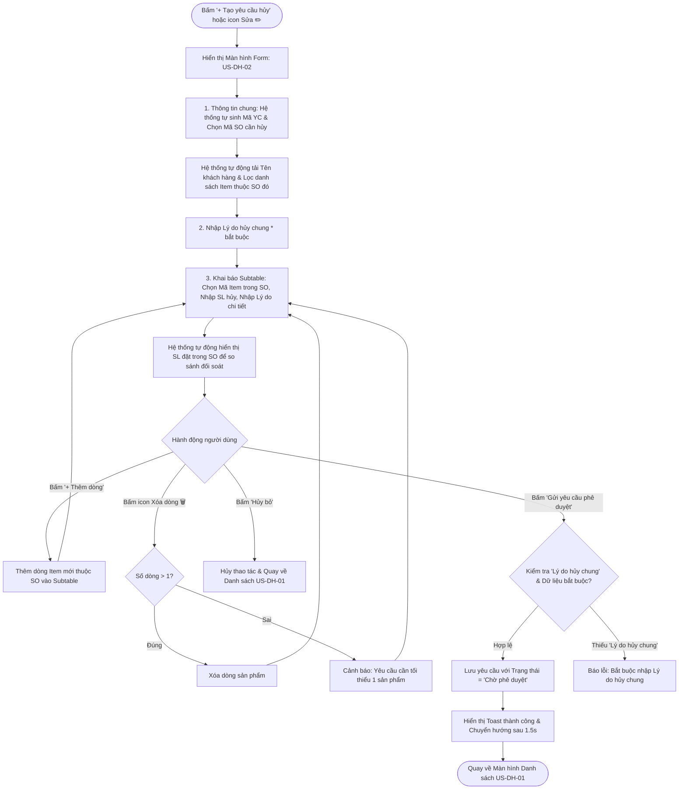

# US-DH-02: Màn hình Tạo mới và Chỉnh sửa Yêu cầu Hủy SO

> **Mã Story:** `US-DH-02`  
> **Module:** Quản lý đơn hàng (Sales Order Management)  
> **Feature:** Yêu cầu hủy SO (Cancel Sales Order Requests)  

---

## 1. Tóm tắt User Story (User Story Statement)
*   **AS A:** Nhân viên Kinh doanh
*   **I WANT TO:** Tạo mới hoặc chỉnh sửa yêu cầu hủy SO bằng cách chọn các sản phẩm trực thuộc đơn hàng gốc và nhập lý do hủy bắt buộc
*   **SO THAT:** Tôi có thể gửi yêu cầu lên cấp quản lý phê duyệt với số lượng và lý do hủy minh bạch, chính xác mà không lo chọn nhầm mã sản phẩm ngoài đơn hàng.

---

## 2. Luồng Nghiệp vụ (Business Flow)

---

## 3. Quy tắc Nghiệp vụ & Ràng buộc Dữ liệu (Business Rules)

### BR 2.1: Cấu trúc Form Thông tin chung (Card 1)
| Trường dữ liệu | Loại Input | Ràng buộc / Validate | Ghi chú hiển thị |
| :--- | :--- | :--- | :--- |
| **Mã yêu cầu** | Text Input | Bắt buộc, Read-only | Tự động sinh theo quy tắc `YCH-YYYY-XXX`. |
| **Mã SO cần hủy** | Select Dropdown | Bắt buộc | Chỉ chọn các SO hợp lệ (chưa xuất kho / chưa hoàn tất). |
| **Khách hàng & Loại đơn** | Text Input | Tự động (Read-only) | Tự động lấy tên khách hàng và loại đơn từ SO gốc (Đề xuất tối ưu). |
| **Lý do hủy chung** | Text Input | **Bắt buộc (*)** | Nhập lý do tổng quát của đợt hủy (Max 500 ký tự). |

### BR 2.2: Ràng buộc Bảng chi tiết sản phẩm (Card 2 - Subtable)
| Cột dữ liệu | Loại Input | Ràng buộc / Validate | Ghi chú hiển thị |
| :--- | :--- | :--- | :--- |
| **Mã Item** | Select Dropdown | **Bắt buộc (*)** | **Chỉ hiển thị danh sách các Item thực tế có trong SO đã chọn.** |
| **SL đặt trong SO** | Text / Badge | Tự động (Read-only) | Hiển thị số lượng đã đặt ban đầu để người dùng đối soát tránh nhập vượt quá. |
| **SL yêu cầu hủy** | Number Input | **Bắt buộc (*)** | Số nguyên dương (`1 <= SL hủy <= SL đặt trong SO`). |
| **Lý do hủy chi tiết** | Text Input | **Không bắt buộc (Optional)** | Ghi chú cụ thể cho từng món nếu có (VD: Khách đổi ni tay, lỗi kỹ thuật...). |

---

## 4. Tiêu chí Chấp nhận (Acceptance Criteria - Gherkin)

### AC 2.1: Lọc Mã Item theo SO đã chọn
*   **Given:** Người dùng đang ở màn hình tạo mới `/cancel-requests/create`.
*   **When:** Người dùng chọn `Mã SO cần hủy = "SO2608001"`.
*   **Then:** Dropdown `Mã Item` ở Subtable chỉ hiển thị các sản phẩm thuộc về đơn hàng `SO2608001`.
*   **And:** Trường `SL đặt trong SO` tự động hiển thị số lượng đặt tương ứng của sản phẩm được chọn.

### AC 2.2: Validate bắt buộc "Lý do hủy chung"
*   **Given:** Người dùng đã chọn Item và số lượng hủy hợp lệ nhưng để trống ô `Lý do hủy chung`.
*   **When:** Người dùng click nút `Gửi yêu cầu phê duyệt`.
*   **Then:** Hệ thống hiển thị cảnh báo lỗi: `"Vui lòng nhập 'Lý do hủy chung' trước khi gửi phê duyệt!"` và chặn không lưu bản ghi.

### AC 2.3: "Lý do hủy chi tiết" là trường không bắt buộc
*   **Given:** Người dùng đã nhập `Lý do hủy chung` và để trống ô `Lý do hủy chi tiết` của từng Item.
*   **When:** Người dùng click `Gửi yêu cầu phê duyệt`.
*   **Then:** Hệ thống vẫn chấp nhận lưu dữ liệu và gửi phê duyệt thành công.

### AC 2.4: Thêm và xóa dòng sản phẩm linh hoạt
*   **Given:** Bảng Subtable đang có N dòng sản phẩm.
*   **When:** Người dùng click nút `+ Thêm dòng sản phẩm`.
*   **Then:** Hệ thống thêm một dòng mới với Mã Item mặc định thuộc SO và `SL hủy = 1`.
*   **When:** Bảng chỉ còn 1 dòng duy nhất và người dùng click icon Xóa (🗑️).
*   **Then:** Hệ thống cảnh báo: `"Yêu cầu hủy cần tối thiểu ít nhất 1 sản phẩm chi tiết!"` và giữ nguyên dòng.

---

## 5. Definition of Done (DoD)
- [x] Đã bỏ trường Tổng SL hủy ở Card 1 và cột Mã MO ở Card 2.
- [x] Dropdown Mã Item chỉ tải các sản phẩm thuộc SO đang chọn.
- [x] Kiểm tra validate: Bắt buộc Lý do hủy chung, không bắt buộc Lý do chi tiết.
- [x] Đã verify chạy hoàn hảo trên Prototype và đồng bộ GitHub.
