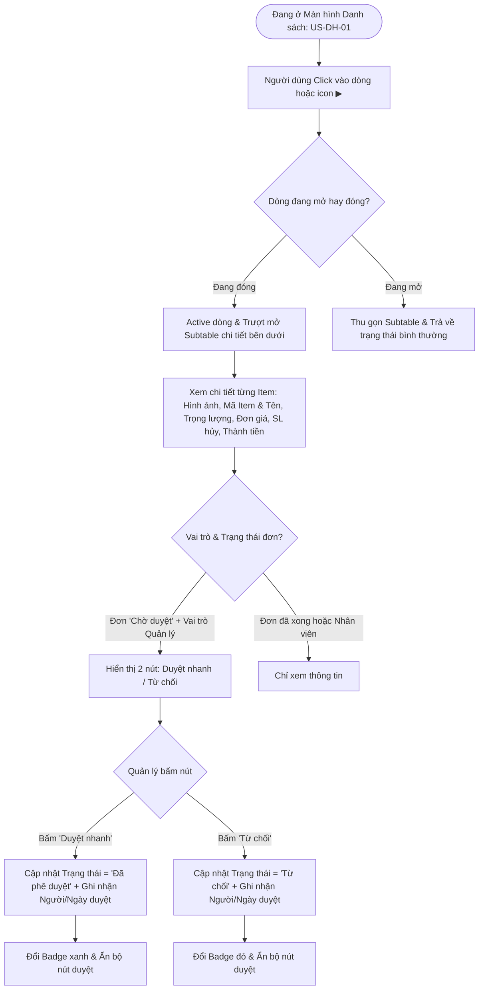

# US-DH-03: Màn hình Chi tiết (Expandable Submenu / Subtable trên Danh sách) & Phê duyệt nhanh

> **Mã Story:** `US-DH-03`  
> **Module:** Quản lý đơn hàng (Sales Order Management)  
> **Feature:** Yêu cầu hủy SO (Cancel Sales Order Requests)  

---

## 1. Tóm tắt User Story (User Story Statement)
*   **AS A:** Quản lý Kinh doanh / Nhân viên phụ trách
*   **I WANT TO:** Click trực tiếp vào một dòng yêu cầu trên bảng danh sách để trượt mở bảng con (Subtable) xem chi tiết hình ảnh, trọng lượng, đơn giá các mặt hàng bị hủy và thực hiện phê duyệt nhanh
*   **SO THAT:** Tôi có thể nắm bắt đầy đủ thông tin chi tiết từng Item mà không cần chuyển trang, rút ngắn thời gian xử lý và ra quyết định phê duyệt tức thì.

---

## 2. Luồng Nghiệp vụ (Business Flow)

---

## 3. Cấu trúc Bảng chi tiết (Subtable Component Structure)

| STT | Cột hiển thị | Kiểu dữ liệu | Mô tả & Quy tắc hiển thị |
| :---: | :--- | :--- | :--- |
| 1 | **STT** | Số nguyên | Thứ tự các Item trong đợt hủy (1, 2, 3...). |
| 2 | **Hình ảnh** | Image Thumbnail | Ảnh mẫu thu nhỏ của sản phẩm. |
| 3 | **Mã Item & Tên SP** | Chuỗi (Text) | Mã và tên sản phẩm vàng/trang sức có trong SO. |
| 4 | **Trọng lượng** | Text / Badge | Trọng lượng sản phẩm (VD: `0.85 chỉ (3.19g)`). |
| 5 | **Đơn giá** | Currency | Đơn giá sản phẩm niêm yết trong đơn hàng gốc. |
| 6 | **SL hủy** | Số nguyên | Số lượng hủy của Item đó, bọc trong Badge đỏ nổi bật (`bg-red-50 text-red-600 font-bold`). |
| 7 | **Thành tiền** | Currency | Tự động tính: `SL hủy × Đơn giá`. |
| 8 | **Lý do hủy chi tiết** | Chuỗi (Text) | Lý do cụ thể của từng món nếu có (Không bắt buộc). |

---

## 4. Tiêu chí Chấp nhận (Acceptance Criteria - Gherkin)

### AC 3.1: Mở và đóng Subtable tương tác mượt mà
*   **Given:** Người dùng đang ở màn hình danh sách `/cancel-requests`.
*   **When:** Người dùng click vào một dòng bất kỳ (VD: Yêu cầu `YCH-2026-001`).
*   **Then:** Dòng đó chuyển sang màu nền `bg-emerald-50/40`, icon mũi tên quay xuống `▼`.
*   **And:** Bảng con Subtable trượt mở ngay bên dưới hiển thị đầy đủ Hình ảnh, Tên Item, Trọng lượng, Đơn giá, SL hủy, Thành tiền của yêu cầu đó.
*   **When:** Người dùng click lại vào dòng đó một lần nữa.
*   **Then:** Bảng con Subtable thu gọn lại và icon mũi tên đổi về `▶`.

### AC 3.2: Duyệt nhanh tại chỗ (Quick Approve)
*   **Given:** Yêu cầu hủy `YCH-2026-002` có trạng thái là `Chờ phê duyệt` và đang được mở Subtable.
*   **When:** Quản lý click nút `Duyệt nhanh`.
*   **Then:** Trạng thái của yêu cầu trên bảng chính lập tức đổi thành `Đã phê duyệt` (Badge màu xanh lá).
*   **And:** Cột `Người phê duyệt` cập nhật tên của Quản lý hiện tại, `Ngày phê duyệt` là ngày hôm nay.
*   **And:** Bộ nút `Duyệt nhanh / Từ chối` trên Subtable tự động biến mất.

### AC 3.3: Từ chối nhanh tại chỗ (Quick Reject)
*   **Given:** Yêu cầu hủy đang ở trạng thái `Chờ phê duyệt`.
*   **When:** Quản lý click nút `Từ chối`.
*   **Then:** Trạng thái của yêu cầu đổi thành `Từ chối` (Badge màu đỏ).
*   **And:** Cột `Người phê duyệt` và `Ngày phê duyệt` được cập nhật tương ứng.

---

## 5. Definition of Done (DoD)
- [x] Tính năng mở rộng dòng (Accordion Subtable) hiển thị đầy đủ Hình ảnh, Trọng lượng, Đơn giá, Thành tiền.
- [x] Bộ nút Phê duyệt nhanh / Từ chối hoạt động cập nhật trạng thái thời gian thực.
- [x] Đã verify chạy hoàn hảo trên Prototype và đồng bộ GitHub.
