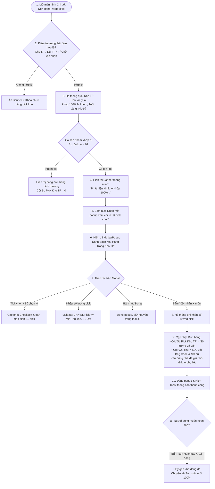

# US-DH-04: Chọn Item Trong Kho Thành Phẩm (Chờ Xử Lý Lại) Vào Đơn Hàng

> **Mã Story:** `US-DH-04`  
> **Module:** Quản lý đơn hàng (Sales Order Management)  
> **Feature:** Chọn Item Kho TP Chờ Xử Lý Lại (Finished Goods Rework Stock Allocation)  
> **Phiên bản:** `1.0` | **Trạng thái:** `Sẵn sàng thẩm định (Ready for Review)`  

---

## 1. Tóm tắt User Story (User Story Statement)

*   **AS A:** Nhân viên Kinh doanh / Kỹ thuật viên Đơn hàng / Quản lý Sản xuất (QLSP)
*   **I WANT TO:** Quét và chọn các mặt hàng tồn trong Kho Thành Phẩm (trạng thái Chờ xử lý lại) có thuộc tính khớp 100% với dòng sản phẩm trong đơn hàng để gán trực tiếp số lượng vào đơn
*   **SO THAT:** Tận dụng tối đa sản phẩm có sẵn trong kho, rút ngắn thời gian giao hàng cho khách, giảm chi phí sản xuất mới, và tự động điều tiết giải phóng giữ chỗ đá về kho phụ liệu.

---

## 2. Bối cảnh & Mục tiêu Nghiệp vụ (Business Context & Objectives)

1.  **Kho Thành Phẩm Chờ Xử Lý Lại:** Là kho lưu trữ các sản phẩm trang sức hoàn chỉnh từ các đơn hàng trước đó bị khách hủy, giảm số lượng đặt, hoặc hàng mẫu sau chào hàng triển lãm. Các sản phẩm này đạt tiêu chuẩn chất lượng xuất kho nhưng cần được phân bổ và xử lý gắn vào đơn hàng mới.
2.  **Nguyên tắc Khớp 100% Thuộc Tính:** Do tính chất đặc thù của ngành vàng bạc trang sức, sản phẩm tồn chỉ được phép gán vào đơn hàng khi thỏa mãn đồng thời:
    *   Trùng khớp **Mã Item (30 ký tự)** & **Mã Drawing (11 ký tự)**.
    *   Trùng khớp **Chất liệu & Tuổi vàng** (VD: `61Y`, `41.7W`, `75W`...).
    *   Trùng khớp **Ni tay / Kích cỡ (Size)** (VD: `NNU - 015`, `VT - 048`...).
    *   Trùng khớp **Màu đá & Loại đá** (VD: `Trắng`, `Xanh`, `CZ Trắng`...).
3.  **Tự Động Điều Tiết Đá (Stone Allocation):** Khi tận dụng sản phẩm có sẵn trong kho, hệ thống tự động giải phóng lượng đá tấm/đá chủ tương ứng đang tạm giữ chỗ (`Partially Released`) để chuyển lại về kho phụ liệu, tránh chiếm dụng vốn và hao hụt đá.

---

## 3. Luồng Nghiệp vụ (Business Flow)

---

## 4. Quy tắc Nghiệp vụ (Business Rules - BR)

| Mã BR | Tên quy tắc | Nội dung quy tắc chi tiết |
| :---: | :--- | :--- |
| **BR-01** | **Điều kiện trạng thái đơn hàng** | Chức năng chỉ kích hoạt khi đơn hàng ở 1 trong 3 trạng thái: `Chờ Kỹ thuật`, `Đủ thông tin KT`, hoặc `Chờ xác nhận (Chờ duyệt)`. Khi đơn đã chuyển `Đã chuyển KHSX` hoặc `Đang sản xuất`, chức năng bị khóa. |
| **BR-02** | **So khớp 100% thuộc tính** | Điều kiện khớp bắt buộc: `ItemCode` == `Stock.ItemCode` VÀ `GoldType` == `Stock.GoldType` VÀ `Size` == `Stock.Size` VÀ `StoneColor` == `Stock.StoneColor`. Nếu lệch bất kỳ 1 thuộc tính nào, tuyệt đối không gợi ý. |
| **BR-03** | **Ràng buộc số lượng pick** | $0 \le \text{SL Pick} \le \min(\text{SL Tồn khả dụng của lô}, \text{SL Đặt của dòng đơn})$. Người dùng không được phép nhập số âm hoặc vượt quá số lượng tồn hiện có. |
| **BR-04** | **Phân loại nguồn hàng (Source Type)** | • Nếu $\text{SL Pick} = \text{SL Đặt}$: Nguồn hàng là `WAREHOUSE_REWORK` (Tận dụng kho 100%, không cần đúc mới). • Nếu $0 < \text{SL Pick} < \text{SL Đặt}$: Nguồn hàng là `SPLIT_ALLOCATION` (Tách nguồn: Đã pick kho X món, sản xuất mới phần còn lại). |
| **BR-05** | **Áp dụng tiền công khách hàng mới** | Sản phẩm pick từ kho cũ vẫn áp dụng theo bảng đơn giá tiền công của khách hàng hiện tại trên SO mới (không phụ thuộc vào tiền công của SO cũ). |
| **BR-06** | **Tự động điều tiết đá (Stone Release)** | Ngay khi xác nhận pick $N$ món từ kho, trạng thái giữ chỗ đá của dòng chuyển sang `PARTIALLY_RELEASED`. Hệ thống tự động giải phóng $N$ phần đá giữ chỗ trả về tồn kho phụ liệu. |
| **BR-07** | **Lưu vết truy xuất (Audit Trail)** | Hệ thống tự động ghi vết vào Ghi chú dòng sản phẩm: `Đã pick {SL} món từ Kho TP ({BagCode} - SO cũ: {OldOrderCode})` để phục vụ đối soát và xuất kho. |

---

## 5. Đặc tả Giao diện & Trường Dữ liệu (Field Specifications)

### 5.1. Banner Thông minh Phát hiện Tồn kho (Top Banner)
*   **Vị trí:** Ngay phía trên bảng danh sách sản phẩm của đơn hàng.
*   **Điều kiện hiển thị:** Đơn hàng đủ điều kiện (BR-01) VÀ tổng tồn kho khớp $> 0$.
*   **Nội dung:** 
    *   Tiêu đề: `Phát Hiện Tồn Kho Thành Phẩm Chờ Xử Lý Khớp 100% Thuộc Tính!`
    *   Mô tả: `Có sẵn {Tổng SL tồn} sản phẩm trong kho có thể tận dụng để giao ngay cho khách hàng.`
    *   Nút bấm: `[Nhấn mở popup xem chi tiết & pick chọn →]` (Màu xanh thương hiệu `#005a46`, click mở Modal).

### 5.2. Modal / Popup Xem Chi Tiết & Pick Chọn Tồn Kho
Bảng dữ liệu trong Popup gồm các cột chuẩn nghiệp vụ:

| STT | Tên cột | Kiểu dữ liệu | Bắt buộc | Mô tả & Quy tắc hiển thị / Tương tác |
| :---: | :--- | :--- | :---: | :--- |
| 1 | **Checkbox** | Lựa chọn (Boolean) | Có | Tick chọn/bỏ chọn lô hàng. Có ô chọn tất cả ở Header. |
| 2 | **Mã Item** | Chuỗi (30 ký tự) | Có | Mã item 30 ký tự, hiển thị kèm Tên sản phẩm, Ni tay và Màu đá. |
| 3 | **SL Đặt** | Số nguyên | Có | Số lượng khách đặt tại dòng đơn hàng tương ứng (Read-only). |
| 4 | **Số Lượng Tồn Kho** | Số nguyên | Có | Số lượng khả dụng của túi tồn kho (VD: `15 món`, `25 món`). Badge xanh. |
| 5 | **Mã Đơn Hàng Cũ** | Chuỗi (SO Code) | Có | Mã SO trước đây đã bị hủy/giảm (VD: `SO2607089`). Rê chuột hiển thị **Tooltip lý do tồn kho** & **Tên khách hàng cũ**. |
| 6 | **Nguyên Liệu - Tuổi Vàng** | Chuỗi | Có | Hiển thị dạng: `Vàng - 61Y`, `Vàng - 41.7W`... |
| 7 | **Ngày Nhập Kho** | Ngày (`DD/MM/YYYY`) | Có | Ngày sản phẩm được chuyển vào kho chờ xử lý lại kèm icon Lịch. |
| 8 | **SL PICK CHỌN** | Ô nhập số (Number Input) | Có | Cho phép nhập số lượng pick. Mặc định bằng $\min(\text{SL Đặt}, \text{SL Tồn})$. Chỉ cho nhập khi dòng được tick chọn. Bị khóa (`disabled`) khi bỏ tick. |

*   **Footer Modal:**
    *   Nút **`[Đóng]`**: Nằm bên trái nút xác nhận, đóng modal và hủy các thay đổi chưa lưu.
    *   Nút **`[Xác nhận (X món)]`**: Hiển thị tổng số lượng món đã chọn pick trên toàn bộ các dòng được tick, click để thực thi gán kho.

### 5.3. Hiển thị Trên Bảng Chi Tiết Sản Phẩm Đơn Hàng (/orders/:id)
*   **Cột `SL PICK KHO TP`:**
    *   Khi chưa pick: Hiển thị số `0` màu xám nhạt tinh gọn (loại bỏ hoàn toàn các nút bấm thừa).
    *   Khi đã pick: Hiển thị badge tỷ lệ số lượng thanh lịch (VD: `40 / 100`, `60 / 100`).
*   **Cột `THAO TÁC`:**
    *   Nếu dòng đã pick kho: Hiển thị icon **Hoàn tác `⟲`** (tooltip: "Hủy pick kho dòng này"). Bấm vào sẽ reset dòng về sản xuất mới 100%.
    *   Icon **Xóa dòng `🗑️`**: Thao tác xóa sản phẩm khỏi đơn hàng.

---

## 6. Ma trận Phân quyền Người dùng (RBAC Matrix)

| Chức năng / Tác vụ | Nhân viên Kinh doanh (Sale) | Kỹ thuật viên (KT) | Quản lý Sản xuất (QLSP) | Quản trị viên (Admin) |
| :--- | :---: | :---: | :---: | :---: |
| **Xem Banner gợi ý tồn kho** | ✅ Xem | ✅ Xem | ✅ Xem | ✅ Xem |
| **Mở Popup xem chi tiết kho** | ✅ Mở & Xem | ✅ Mở & Xem | ✅ Mở & Xem | ✅ Mở & Xem |
| **Thực hiện Pick chọn số lượng** | ✅ Thao tác | ✅ Thao tác | ✅ Thao tác | ✅ Thao tác |
| **Xác nhận gán kho vào đơn hàng** | ✅ Xác nhận | ✅ Xác nhận | ✅ Xác nhận | ✅ Xác nhận |
| **Hủy gán kho (Hoàn tác dòng)** | ✅ Hoàn tác | ✅ Hoàn tác | ✅ Hoàn tác | ✅ Hoàn tác |

---

## 7. Tiêu chí Chấp nhận (Acceptance Criteria - Gherkin)

### AC 1: Hiển thị Banner gợi ý tồn kho khi đơn hàng có sản phẩm khớp 100%
*   **Given:** Đơn hàng `SO2608011` ở trạng thái `Chờ Kỹ thuật`.
*   **And:** Trong Kho TP Chờ xử lý lại có 3 lô hàng khớp 100% thuộc tính với tổng số lượng là 160 món.
*   **When:** Người dùng truy cập vào trang chi tiết đơn hàng `/orders/11`.
*   **Then:** Hệ thống hiển thị Banner màu xanh thông báo: *"Phát Hiện Tồn Kho Thành Phẩm Chờ Xử Lý Khớp 100% Thuộc Tính! Có sẵn 160 sản phẩm..."*.
*   **And:** Banner có nút bấm *"Nhấn mở popup xem chi tiết & pick chọn →"*.

### AC 2: Mở Popup và tải dữ liệu tồn kho chuẩn xác
*   **Given:** Banner gợi ý tồn kho đang hiển thị.
*   **When:** Người dùng click vào nút *"Nhấn mở popup xem chi tiết & pick chọn →"*.
*   **Then:** Modal bật lên trong thời gian $\le 200\text{ms}$ với tiêu đề *"Danh Sách Mặt Hàng Trong Kho Thành Phẩm Chờ Xử Lý"*.
*   **And:** Bảng hiển thị đầy đủ các cột: Checkbox, Mã Item, SL Đặt, SL Tồn kho, Mã đơn cũ, Tuổi vàng, Ngày nhập kho, SL Pick chọn.
*   **And:** Các dòng mặc định được tick chọn và ô `SL PICK CHỌN` tự điền số lượng mặc định bằng $\min(\text{SL Đặt}, \text{SL Tồn})$.

### AC 3: Validation số lượng nhập trong ô SL Pick Chọn
*   **Given:** Người dùng đang thao tác tại ô `SL PICK CHỌN` của lô tồn có tồn khả dụng là 20 món và số lượng dòng đặt là 100 món.
*   **When:** Người dùng nhập số lượng `25` (vượt quá tồn kho).
*   **Then:** Hệ thống tự động giới hạn và đưa giá trị về giá trị tối đa cho phép là `20`.
*   **When:** Người dùng nhập số `0` hoặc xóa trắng.
*   **Then:** Dòng đó tự động bị bỏ tick Checkbox và tổng số lượng trên nút xác nhận được trừ đi tương ứng.

### AC 4: Thao tác Checkbox chọn / bỏ chọn và Chọn tất cả
*   **Given:** Modal đang hiển thị danh sách các lô hàng tồn.
*   **When:** Người dùng bỏ tick Checkbox tại một dòng bất kỳ.
*   **Then:** Ô `SL PICK CHỌN` của dòng đó chuyển sang trạng thái disabled và giá trị về `0`.
*   **When:** Người dùng tick chọn lại dòng đó.
*   **Then:** Ô `SL PICK CHỌN` được mở khóa và tự động điền lại số lượng khả dụng mặc định.
*   **When:** Người dùng click Checkbox tổng trên tiêu đề bảng.
*   **Then:** Hệ thống tự động chọn tất cả hoặc bỏ chọn tất cả toàn bộ các dòng.

### AC 5: Xác nhận Pick kho và cập nhật đơn hàng thành công
*   **Given:** Người dùng đã chọn pick tổng cộng 130 sản phẩm từ kho.
*   **When:** Người dùng click vào nút *"Xác nhận (130 món)"*.
*   **Then:** Modal tự động đóng lại.
*   **And:** Hệ thống hiển thị Toast thông báo: *"Đã đồng bộ và pick chọn thành công sản phẩm từ Kho Thành Phẩm vào đơn hàng!"*.
*   **And:** Tại bảng chi tiết sản phẩm của đơn hàng:
    *   Cột `SL PICK KHO TP` hiển thị tỷ lệ đã gán (VD: `40/100`, `60/100`, `30/100`).
    *   Cột `Ghi chú` hiển thị chi tiết: `Đã pick {SL} món từ Kho TP ({BagCode} - SO cũ: {OldSO})`.
    *   Cột `Thao tác` xuất hiện thêm icon Hoàn tác `⟲`.

### AC 6: Hoàn tác / Hủy gán kho cho từng dòng sản phẩm
*   **Given:** Dòng sản phẩm STT 1 đang có `SL PICK KHO TP` là `40/100`.
*   **When:** Người dùng click vào icon Hoàn tác (`⟲`) tại cột Thao tác của dòng STT 1.
*   **Then:** Dòng STT 1 được reset về trạng thái sản xuất mới 100%:
    *   `SL PICK KHO TP` trở về `0`.
    *   Ghi chú trở về `---`.
    *   Nguồn hàng chuyển thành `NEW_PRODUCTION`.
    *   Lượng đá giữ chỗ được kích hoạt giữ lại cho sản xuất mới.

### AC 7: Khóa chức năng khi đơn hàng không ở trạng thái hợp lệ
*   **Given:** Đơn hàng ở trạng thái `Đã chuyển KHSX` hoặc `Đang sản xuất`.
*   **When:** Người dùng mở xem chi tiết đơn hàng.
*   **Then:** Banner gợi ý tồn kho không hiển thị.
*   **And:** Cột `SL PICK KHO TP` chỉ hiển thị số lượng ở chế độ Read-only, không cho phép can thiệp chỉnh sửa.

---

## 8. Ma trận Trường hợp Biên (Edge Cases Matrix)

| Trường hợp biên (Edge Case) | Mức độ | Hành vi hệ thống mong đợi |
| :--- | :---: | :--- |
| **Nhiều lô hàng cùng khớp 1 dòng đặt** | Trung bình | Liệt kê từng lô theo mã túi (`BagCode`) riêng biệt để người dùng chủ động chọn lô có ngày nhập kho cũ nhất (nguyên tắc FIFO). |
| **Tồn kho khả dụng nhỏ hơn SL đặt** | Thấp | Tự động tách nguồn hàng thành `SPLIT_ALLOCATION`: phần thiếu chuyển sang lệnh đúc mới tự động. |
| **Tranh chấp tồn kho đồng thời (Concurrency)** | Cao | Khi người dùng bấm Xác nhận, hệ thống kiểm tra lại tồn kho tức thời. Nếu lô hàng đã bị đơn khác pick trước, hiển thị cảnh báo: *"Lô hàng [BagCode] đã được phân bổ cho đơn khác, vui lòng chọn lại"* và tải lại số liệu mới. |
| **Khách hàng thay đổi yêu cầu sau khi đã pick** | Trung bình | Người dùng có thể bấm icon `⟲` để nhả hàng tồn về kho bất kỳ lúc nào trước khi đơn chuyển sang KHSX. |

---

## 9. Definition of Done (DoD)

- [x] Đã chuẩn hóa tài liệu đặc tả User Story theo chuẩn BA-Kit và cấu trúc quy định của dự án.
- [x] Đã hiện thực hóa giao diện Banner, Popup 8 cột và Bảng đơn hàng trên Prototype ([`/orders/11`](file:///d:/BA/H%E1%BB%8Dc%20AI/order-prototype/src/app/orders/%5Bid%5D/page.js)).
- [x] Đã kiểm thử đầy đủ các kịch bản AC (Pick thành công, Validation giới hạn Max, Hoàn tác dòng).
- [x] Giao diện tuân thủ nguyên tắc tinh gọn (Strict Minimalism), loại bỏ hoàn toàn các nút thừa và badge rườm rà.
- [x] Lưu trữ tài liệu vào kho mã nguồn: [`docs/user-stories/US-DH-04-chon-item-kho-thanh-pham-cho-xu-ly-lai.md`](file:///d:/BA/H%E1%BB%8Dc%20AI/order-prototype/docs/user-stories/US-DH-04-chon-item-kho-thanh-pham-cho-xu-ly-lai.md).
