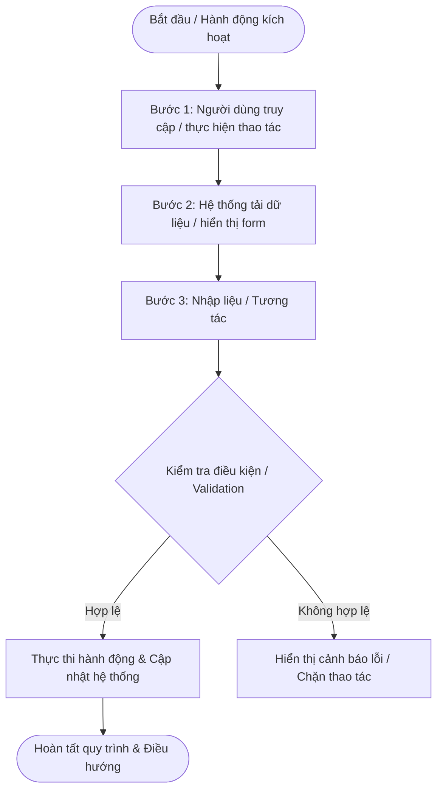

# US-[MODULE]-[XX]: [Tên User Story]

> **Mã Story:** `US-[MODULE]-[XX]`  
> **Module:** [Tên Module - Ví dụ: Quản lý đơn hàng (Sales Order Management)]  
> **Feature:** [Tên Tính năng - Ví dụ: Yêu cầu hủy SO (Cancel Sales Order Requests)]  

---

## 1. Tóm tắt User Story (User Story Statement)
*   **AS A:** [Vai trò người dùng - Ví dụ: Nhân viên Kinh doanh, Quản lý Kỹ thuật...]
*   **I WANT TO:** [Hành động/Tính năng mong muốn thao tác trên hệ thống]
*   **SO THAT:** [Mục đích và giá trị nghiệp vụ mang lại cho người dùng / doanh nghiệp]

---

## 2. Luồng Nghiệp vụ (Business Flow)

---

## 3. Đặc tả Cột Dữ liệu / Giao diện (Field Specifications)

| STT | Tên trường / Cột | Kiểu dữ liệu | Bắt buộc | Mô tả & Quy tắc hiển thị / Validation |
| :---: | :--- | :--- | :---: | :--- |
| 1 | **[Tên trường 1]** | Chuỗi (Text) / Số / Ngày | Có / Không | [Mô tả mục đích, format hiển thị, giá trị mặc định] |
| 2 | **[Tên trường 2]** | Lựa chọn (Select Dropdown) | Có / Không | [Danh sách giá trị lựa chọn, quy tắc lọc] |
| 3 | **[Tên trường 3]** | Tự động tính (Read-only) | Có | [Công thức tính toán hoặc quy tắc sinh mã tự động] |
| 4 | **Trạng thái** | Phân loại (Enum) | Có | Badge màu phân biệt:  • `Trạng thái 1` (Vàng) • `Trạng thái 2` (Xanh lá) • `Trạng thái 3` (Đỏ) |
| 5 | **Thao tác** | Hành động (Action) | Có | Icon Sửa ✏️, Xóa 🗑️, Xem chi tiết... |

---

## 4. Tiêu chí Chấp nhận (Acceptance Criteria - Gherkin)

### AC 1: [Tên kịch bản 1 - Luồng thành công / Happy Path]
*   **Given:** [Ngữ cảnh / Tiền điều kiện ban đầu trước khi thao tác]
*   **When:** [Hành động thao tác của người dùng]
*   **Then:** [Kết quả mong đợi: Hệ thống xử lý dữ liệu, lưu DB, thay đổi UI ra sao]
*   **And:** [Các hiệu ứng phụ kèm theo nếu có (Thông báo Toast, chuyển trang...)]

### AC 2: [Tên kịch bản 2 - Luồng ngoại lệ / Validation / Edge Case]
*   **Given:** [Ngữ cảnh xảy ra ngoại lệ]
*   **When:** [Người dùng nhập sai, bỏ trống trường bắt buộc, hoặc thao tác ngoài phạm vi]
*   **Then:** [Hệ thống hiển thị thông báo lỗi cụ thể và chặn không cho tiếp tục]

### AC 3: [Tên kịch bản 3 - Tương tác giao diện / Real-time Behavior]
*   **Given:** [Giao diện đang mở form/bảng]
*   **When:** [Người dùng tương tác nhập số lượng, click mở rộng dòng...]
*   **Then:** [Hệ thống tự động tính toán / mở rộng Subtable với thời gian phản hồi ≤ 300ms]

---

## 5. Definition of Done (DoD)
- [ ] Giao diện chuẩn UI/UX hệ thống, tương thích hiển thị trên Desktop.
- [ ] Đầy đủ các trường dữ liệu và ràng buộc validation theo đặc tả.
- [ ] Đã kiểm thử các kịch bản Acceptance Criteria (Happy path & Edge cases).
- [ ] Đã verify trên môi trường Prototype/Staging và sync code lên kho lưu trữ.
